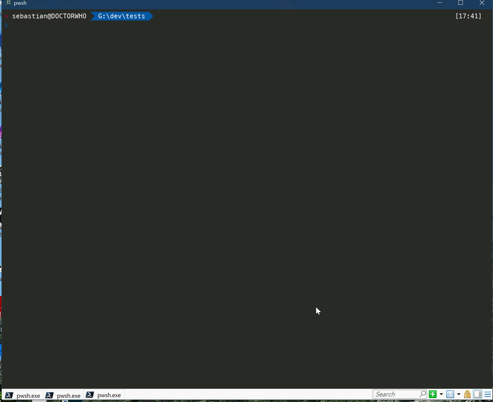

# NukedBit.NRepo

[](https://nukedbit.visualstudio.com/NukedBit/_build/latest?definitionId=11)



## Info

<p style="color:red">Beware this is a new tool, so be safe and backup your data.</p>
<p style="color:red">At this time is tested only on Windows, but it should work on other os.</p>

It's a simple tool that allow you to create a new repository or init one inside an existing folder.

Currently the tool support only c# repos with good defaults taken from the AspNetCore repos.
The repo that will be created at github is going to be public.


It will add
* .editorconfig
* .gitignore 
* .gitattributes

## Futures

* Ability to create a private repository over github.
* Allow templates to be specified for other languages
* Custom local templates

## Setup && usage

To install just issue this command, it require dotnet 2.2.200

```dotnet tool install --global NukedBit.NRepo --version 0.1.0```

You can either specify a folder with -n:mynewrepo or if you just specify -n it will use the current folder.

```nrepo -n:mynewrepo```

or 

```nrepo -n```


